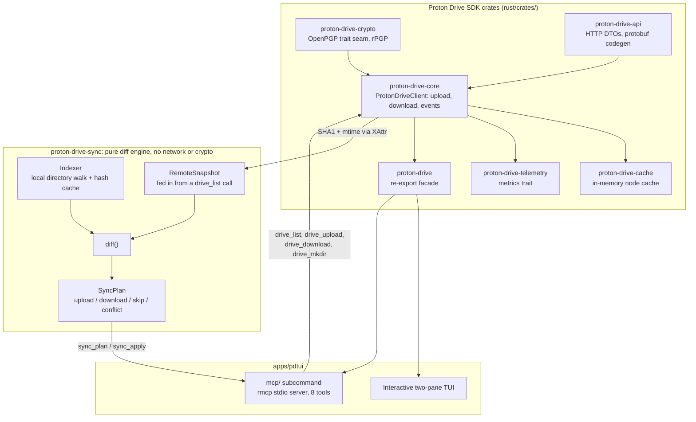

# Proton Drive SDK: Rust port + `pdtui`

A Rust implementation of the Proton Drive SDK, plus **`pdtui`**, a two-pane
terminal file browser and an MCP server for agent-driven sync, built for
personal use against your own Proton Drive account.

> **Status: working MVP, unaudited.** The core crypto-backed transfer path is
> live-validated end to end (SRP login → list → upload → byte-identical
> download), including nested files and large real-world content. The newer
> MCP agentic-sync surface (`pdtui mcp`) is unit- and wire-tested but has not
> yet been run against a live account, so treat it as a step behind the
> transfer path until that validation happens. Neither has had an
> independent security audit. Use this against your own account only. This
> project is **not affiliated with or endorsed by Proton AG.**

The upstream native SDKs (TypeScript, C#, Kotlin, Swift) that this port follows
for wire-format fidelity live under [`reference/`](./reference/) and remain the
authoritative source for those languages.


`pdtui` (right) beside the official Proton Drive web UI (left): the same
`pdtui-mvp-*.txt` files appear in both panes, uploaded and downloaded
byte-identically through the live Proton API.

## What works (live-validated)

| Capability | State |
|---|---|
| SRP login + session resume (OS keyring) | Live |
| List folder children (decrypts names, sizes, types) | Live |
| Upload to the My Files root: wire-faithful armoured protocol, HMAC name hash, XAttr | Live, byte-identical round trip |
| Upload into a **nested** (non-root-parent) folder | Live (fixed via the shared full-chain parent resolver already used by nested listing/download, live-verified at depth 3; regression-tested for the upload path specifically) |
| Download: block fetch, SHA-256 integrity, manifest verification | Live |
| Nested files: parent-chain node-key derivation for **listing/download** (depth ≥ 3) | Live (646 MB real file verified) |
| Signature-issue tolerance (rotated-out signer keys) | Delivers data, flags `signature_verified=false` (matches the official client) |
| Event subscription | Live: background poll/backoff loop drives pdtui's remote pane, falling back to pull-on-focus if the subscription can't be established |

Integrity model mirrors the JS SDK: blocks are guarded by their SHA-256
ciphertext hash, and the manifest signature is verified **after** the data is
delivered. A *missing* manifest signature aborts before any byte is written; a
*present-but-unverifiable* one (the signer's key was rotated out of the
account) delivers the data and reports `signature_verified = false` rather
than discarding a file the official client would still download.

## MCP agentic sync (`pdtui mcp`)

`pdtui mcp` serves the [Model Context Protocol](https://modelcontextprotocol.io)
over stdio, using the `rmcp` crate, so an AI agent (Claude Code or any other
MCP-speaking host) can browse and mutate the owner's Drive directly instead of
shelling out to `pdtui` and scraping stdout. It reuses the same keyring
session `pdtui login` already establishes; there is no separate credential
store, and it is never a listening network service.

The design lives in [`docs/adr/0013-mcp-server-surface.md`](docs/adr/0013-mcp-server-surface.md),
[`docs/PRD-mcp-agentic-sync.md`](docs/PRD-mcp-agentic-sync.md), and
[`docs/domain-model-sync.md`](docs/domain-model-sync.md). Three ideas carry the
whole design:

- **Plan and apply are separate calls.** `sync_plan` is a pure dry run: it
  diffs a local directory against a remote folder and returns proposed
  operations with no side effects. `sync_apply` executes only the operations
  named in a plan the agent has already seen, and a hash-differ conflict is
  always returned undecided rather than auto-resolved by either side winning.
- **Content digests are computed on demand, not attached to every listing.**
  SHA1 comes from decrypting a file's `XAttr`, which costs an extra request
  per file, so `drive_list` only fetches it when a caller asks for
  `include_digest`.
- **Remote change detection rides the existing Events API loop** (the same
  `spawn_volume_event_loop` the interactive TUI already uses), never a new
  polling timer.

The eight tools:

| Tool | What it does |
|---|---|
| `drive_list` | Lists a remote folder's children by logical path, with an optional per-file SHA1 digest |
| `drive_download` | Downloads a node to a local path, refusing to overwrite unless told to |
| `drive_upload` | Uploads a new file, or (with explicit opt-in) a new revision of an existing one |
| `drive_mkdir` | Creates a remote folder |
| `local_index` | Walks a local directory tree, hashing files with a size/mtime cache so unchanged files aren't rehashed |
| `sync_plan` | Diffs a local root against a remote folder into upload, download, skip, and conflict operations |
| `sync_apply` | Executes a stored plan's operations, resolving only the conflicts named in `decisions` |
| `events_poll` | Drains the Events subscription on demand, so an agent can check for remote changes before trusting a plan it already holds |

## Architecture



`proton-drive-sync` depends on nothing above the diagram: no network calls, no
crypto, no async runtime. It takes a `LocalIndex` and a caller-supplied
`RemoteSnapshot` and produces a `SyncPlan`, which is what makes it testable
without a live session and reusable by both `pdtui mcp` and any future
interactive sync UI.

## Quick start

```bash
cd rust
cargo build --release -p pdtui

# Log in with your real Proton credentials (SRP is live; session → OS keyring).
./target/release/pdtui login

# Headless end-to-end acceptance check (list → upload → download → byte-compare).
./target/release/pdtui mvp

# Serve the MCP tool surface over stdio, for an agent such as Claude Code.
./target/release/pdtui mcp

# Interactive two-pane browser (local | remote).
./target/release/pdtui
```

Set `PDTUI_LOG=info` (or `debug`) for structured logs.

## Repository layout

| Path | Contents |
|---|---|
| [`rust/`](./rust/) | The project: a Cargo workspace with the SDK crates (`proton-drive-{crypto,api,core,cache,telemetry}`), the pure `proton-drive-sync` diff engine, and the `pdtui` app (TUI plus its `mcp` subcommand) |
| [`docs/`](./docs/) | PRDs, domain models, and [ADRs](./docs/adr/README.md) for the port |
| [`tests/`](./tests/) | Cross-language wire-format fixtures consumed by the crypto tests |
| [`scripts/`](./scripts/) | Dev tooling: session config, JS cross-check probes |
| [`reference/`](./reference/) | Vendored upstream Proton SDKs monorepo (JS, C#, Kotlin, Swift), the wire-format source of truth. See [`reference/VENDORED.md`](./reference/VENDORED.md) for the pinned commit |
| [`HANDOFF.md`](./HANDOFF.md) | Engineering handoff and current status |

The Rust API crate generates its cross-language wire types at build time from
the protobuf in [`reference/client/cs/src/protos/`](./reference/client/cs/src/protos/).

## How this got here

A seven-agent mesh reviewed the Rust port line by line against the JS SDK
reference on 2026-07-05, confirmed 38 findings, and landed a fix package for
every one, including the nested-folder upload gap in the table above. See
[`docs/audit-2026-07-05.md`](docs/audit-2026-07-05.md) for what changed and
[`docs/IMPLEMENTATION-STATUS.md`](docs/IMPLEMENTATION-STATUS.md) for the
current milestone-by-milestone state.

The MCP agentic-sync feature went through its own review after landing: a
high-effort code review resolved 10 confirmed defects, then a five-dimension
Opus audit checked guardrails, wire fidelity, and those 10 fixes again (all
held), and applied three further hardening findings (argument validation
before URL interpolation, a cycle guard on remote folder walks, and a
cross-volume cache-key fix). The workspace gate, `cargo fmt`, `clippy -D
warnings`, `cargo test --workspace`, is green at 330 tests. As the status
banner says: green tests are not a live-account proof, and the MCP surface
still needs one.

## Operational requirements

These apply to **any** client of Proton Drive, including this one. Rate limits
are shared with first-party clients.

- **Identify honestly.** The client sets `x-pm-appversion` as
  `external-drive-pdtui@{semver}-stable`. Never spoof a first-party header.
- **Official endpoints only.** All HTTP hits the official Proton Drive domain;
  no proxying.
- **Event-based sync.** No ad hoc polling of node/listing state or recursive
  tree traversal. The event-loop consumer's own interval poll against the
  official Events endpoint (mirroring the JS SDK's `eventManager.ts`, since
  Proton Drive has no push transport) is the one sanctioned exception.
- **No Proton branding.** This is an unofficial, third-party tool.

A breaking cryptographic-model migration is targeted by Proton for late
2026/early 2027; clients implementing only the current model will not
interoperate after it lands.

## Reference implementations

The upstream native SDKs under [`reference/`](./reference/):

| SDK | Location |
|---|---|
| TypeScript | [`reference/client/js/`](./reference/client/js/) ([changelog](./reference/client/js/CHANGELOG.md)), published as [`@protontech/drive-sdk`](https://www.npmjs.com/package/@protontech/drive-sdk) |
| C# | [`reference/client/cs/`](./reference/client/cs/) ([changelog](./reference/client/cs/CHANGELOG.md)) |
| Kotlin and Swift | bindings wrapping the C# SDK: [`reference/incubating/client/kt/`](./reference/incubating/client/kt/), [`reference/incubating/client/swift/ProtonDriveSDK/`](./reference/incubating/client/swift/ProtonDriveSDK/) |

## Licence

MIT, see [LICENSE.md](./LICENSE.md). <!-- slop-ignore: filename, must match the file on disk -->
The MIT licence governs the source in this repository only; access to
Proton's hosted services remains subject to Proton's separate terms of
service and operational policies.

Upstream SDK code under `reference/` is Copyright (c) 2026 Proton AG.
