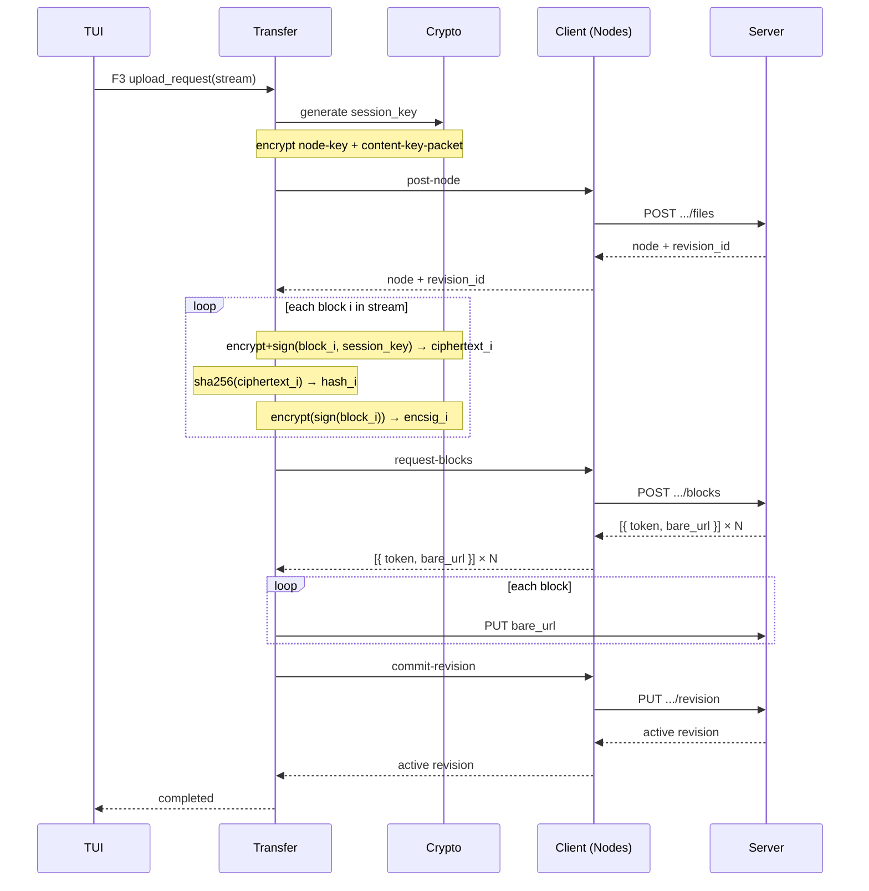
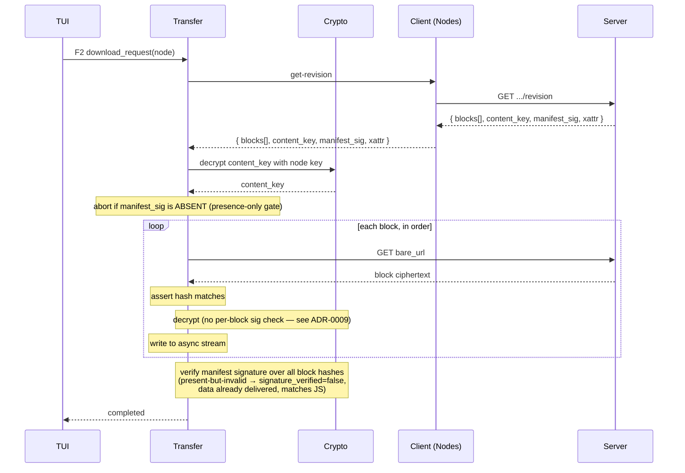

# Domain model: MVP addendum

Supplements `domain-model.md` with the aggregates that matter for upload/download. Same bounded contexts; this file adds detail on the **Transfer** context that was a placeholder before.

## New / refined aggregates

### Transfer (aggregate root)

A single user-initiated file movement (upload or download), one revision in scope. Owns the block stream.

```
Transfer                                       // apps/pdtui/src/transfer.rs
├── label: String                              // usually the file name
├── direction: Upload | Download
├── node_uid: NodeUid                          // target if upload, source if download
├── state: Pending | Running | Completed | CompletedUnverified | Cancelled | Failed(String)
├── progress: TransferProgress { bytes_done: u64, bytes_total: Option<u64> }
└── progress_rx, total_rx, outcome_rx, cancel  // private watch channels + token driving `poll`
```

This landed as a `pdtui`-level queue entry that drives one `FileUploader` /
`FileDownloader` call, not a persisted SDK aggregate: there is no stored `id`,
the stream is owned by the spawned upload/download task rather than the
struct, and there is no `manifest` field. `CompletedUnverified` is a download-only
terminal state (mirrors `proton_drive_core::download::DownloadStats::signature_verified
== false`: every block hash matched but the manifest signature could not be
verified); its counterpart, `TransferOutcome { signature_verified: Option<bool> }`,
is carried once through `outcome_rx` on completion rather than stored.

Invariants:
- A Transfer moves through states monotonically. `Completed`, `CompletedUnverified`, `Cancelled`, and `Failed` are terminal.
- `progress.bytes_done` is compared against `progress.bytes_total` only once the latter is known (`Some`); uploads set it immediately from the local file size, downloads from the remote revision's XAttr-declared plaintext size (`claimed_size`), and it stays `None` when that XAttr is missing or undecryptable.
- A Transfer holds an exclusive lock on its target `NodeUid` for the duration. Two concurrent uploads to the same parent with the same name: the second one fails fast at the node-creation step (server-enforced; we just propagate).

### Block (value object, landed as `EncryptedBlock`, internal to the upload path)

```
EncryptedBlock {
  index: u32,                    // 1-based within revision; index 0 is rejected
  ciphertext: Bytes,             // SEIPDv1, includes inline signature
  ciphertext_hash_hex: String,   // hex-encoded sha256(ciphertext)
  enc_signature: String,         // armoured detached signature, encrypted to the encryption key
  verifier_token_b64: String,    // server-issued verifier, checked by the encrypt-then-self-verify retry
}
```

Blocks are content-addressable by `(NodeUid, RevisionId, index)`. Server rejects size > 4 MiB (`proton_drive_core::upload::BLOCK_SIZE`). We chunk at exactly 4 MiB except the last; `size` is not a stored field, it is always `ciphertext.len()`. `EncryptedBlock` is a private type in `proton-drive-core::upload`; it never crosses the crate's public API.

### Revision (entity inside Node aggregate)

```
Revision {                        // proton_drive_core::nodes::Revision
  uid: String,
  state: Draft | Active | Superseded,     // RevisionState
  size_bytes: Option<u64>,
  created_at: SystemTime,
  author: Author,
  content_sha1: Option<String>,           // Common.Digests.SHA1, from decrypted xattr
  xattr_modification_time: Option<SystemTime>,
}
```

This is the decrypted, at-rest view the rest of the port sees. The wire-level
payload used while a revision is in flight (block list, `ContentKeyPacket`,
`ContentKeyPacketSignature`, `ManifestSignature`) is a separate type,
`proton_drive_api::nodes::RevisionWithBlocks`, an anti-corruption-boundary
DTO (`domain-model.md` §4) never stored on the domain `Revision`. `upload.rs`
and `download.rs` consume it transiently to build/verify a revision and then
discard it.

State machine: Draft → Active (on commit) → Superseded (by a later upload to the same node). Draft revisions older than 24h are reaped server-side; we don't track them.

### Node (already in domain-model.md; extending)

For MVP we need three flavours discriminated by `Link.Type`:
- `Folder`: has children, no revisions
- `File`: has an active revision
- `Album` (photos): **out of scope**, ignore

The TS field `Link.MIMEType` distinguishes File subtypes (text, image, …). MVP treats them all the same.

## Cross-context flows

### Upload (Transfer → Crypto → Nodes → Blocks)



### Download (Transfer ← Crypto ← Nodes ← Blocks)



## Anti-corruption boundaries (additions)

- **Server-issued URLs are opaque.** The `bare_url` for a block is treated as a blob; we don't parse, normalise or rewrite it. If Proton changes its CDN routing, we follow.
- **`Hash` is sha256 of ciphertext, not plaintext.** Be precise: JS calls it `Hash` everywhere and the naming is ambiguous. In Rust we use `ciphertext_hash` in field names where possible.
- **`SignatureAddress` is an Address ID + Address Email + first signing key fingerprint.** Resolve from the local Account context; the API returns only the address ID, we map back via the host-provided `AddressProvider`.

## Invariants enforced in code (not just docs)

| Invariant | Where |
|---|---|
| Block size ≤ 4 MiB | Structural, not a runtime check: `BlockUploadCtx::upload_after_create` (`proton-drive-core::upload`) reads each block into a fixed `BLOCK_SIZE`-capacity buffer, so no block can be produced larger than 4 MiB |
| Block count fits in u32 | Not separately enforced: `block_index: u32` increments once per 4 MiB block with no overflow guard. Harmless at the current 16 MiB MVP file-size cap (≤ 4 blocks); revisit if that cap is lifted |
| File size ≤ 16 MiB for MVP | `UploadMetadata::validate()` rejects `expected_size > MAX_FILE_SIZE`. `expected_size` is a required `u64`, not an optional hint; there is no accumulate-and-check-at-commit fallback for a stream of unknown length |
| Active revisions have at least one block | enforced by server, propagated as `Error::ProtocolViolation` if violated |
| Block hash matches between client and server | per-block check after PUT response |
| Manifest signature *presence* gates download | a **missing** manifest signature aborts before any block is fetched; the cryptographic verification itself runs **after** all blocks are delivered (needs the full block-hash list), matching the JS SDK (see ADR-0009) |
| Per-block ciphertext hash verifies on fetch | `sha256(ciphertext)` checked against the server-supplied `Hash` before decrypt; one mismatched block fails the transfer. Per-block *signatures* are deliberately never checked (see ADR-0009 / IMPLEMENTATION-STATUS.md B5) |

## What's still informal (no aggregate yet)

- **Cache invalidation.** MemoryCache has no TTL. Upload invalidates by re-inserting the new Node, but cached folder listings get stale. TUI focus-change on the remote pane still triggers a fresh `iter_folder_children` as a fallback; a live drive-event now also flags the pane stale directly (see below). Real cache coherence is a post-MVP concern.
- **Events.** A real consumer landed (`proton-drive-core::events::{drain_volume_events, spawn_volume_event_loop}`, exposed as `ProtonDriveClient::subscribe_drive_events`), and `pdtui` wires it into the remote pane (`apps/pdtui/src/events_bridge.rs`): a relevant drive event (node create/update/trash/restore/delete/rename, tree refresh, tree removal) flips a staleness flag the app checks once per redraw tick. Subscription failure degrades gracefully to the original pull-on-focus behaviour rather than erroring.
